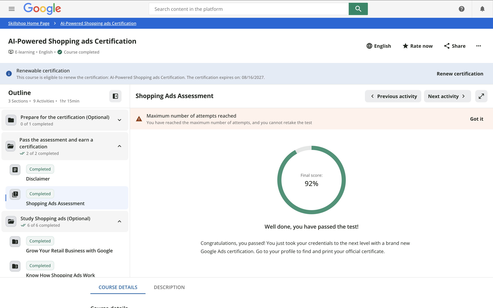

# Exam Completion

# Final Application Summary

1.  **What are the three most useful concepts you learned from the Google Shopping Ads certification process?**
    The most valuable takeaway was understanding the product feed as the foundation of everything. Attributes like price, availability, and product type aren't just data entry, they directly determine ad approval, search matching, and trust with shoppers. Second was learning how Performance Max automates budget allocation and bidding across channels in real time, which reframed how I think about campaign structure entirely. Third was the policy layer: accurate pricing, secure checkout, and clearly disclosed return policies aren't optional details, they're enforceable requirements that can get items disapproved or accounts suspended if ignored.

2.  **How did the certification help you understand CPP Farm Store's omnichannel opportunities?**
    Working through the distinctions between store-visit, online sales, and omnichannel goals clarified that the Farm Store doesn't fit neatly into one category. It's a physical store, but their goal of optimizing the gift basket ordering system into a full online inventory and shopping platform is fundamentally an online sales objective. The certification helped me see that as the business builds out its e-commerce capability, campaign strategy needs to evolve alongside it, starting narrow with gift baskets and expanding as the feed and site infrastructure mature.

3.  **How did you personally apply this knowledge to your group project?**
    I used the objective-product-campaign type-channel-KPI framework directly when reasoning through the Farm Store's application. I recommended treating the gift basket catalog as the seed product feed for a Performance Max campaign built around an online sales goal, prioritizing that catalog first before layering in complementary products.

4.  **What part of Shopping Ads or retail media do you now feel more confident discussing professionally?**
    I feel most confident explaining product feed structure and Merchant Center policy compliance, specifically why attributes matter, what's required versus optional, and how disapprovals and suspensions actually work. I'm also comfortable explaining the strategic trade-off between Standard Shopping's manual control and Performance Max's automated reach, and matching that trade-off to a specific client's goals rather than defaulting to one or the other.

5.  **How could you describe this certification or skill on your resume or LinkedIn profile?**
    "Google Shopping Ads Certified: skilled in Merchant Center product feed setup and policy compliance, Standard Shopping and Performance Max campaign strategy, and retail media planning for omnichannel and online sales objectives."
